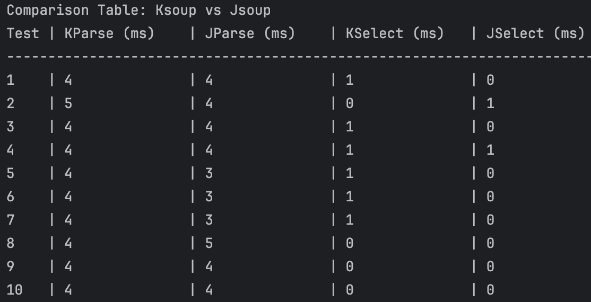

# Ksoup: Kotlin Multiplatform HTML & XML Parser

**Ksoup** is a Kotlin Multiplatform library for working with real-world HTML and XML. It's a port of the renowned Java library, **jsoup**, and offers an easy-to-use API for URL fetching, data parsing, extraction, and manipulation using DOM and CSS selectors.

[](https://kotlinlang.org)
[](https://opensource.org/licenses/Apache-2.0)
[](https://central.sonatype.com/artifact/com.fleeksoft.ksoup/ksoup)


Ksoup implements the [WHATWG HTML5](https://html.spec.whatwg.org/multipage/) specification, parsing HTML to the same DOM as modern browsers do, but with support for Android, JVM, and native platforms.

## Features
- Scrape and parse HTML from a URL, file, or string
- Find and extract data using DOM traversal or CSS selectors
- Manipulate HTML elements, attributes, and text
- Clean user-submitted content against a safe-list to prevent XSS attacks
- Output tidy HTML

Ksoup is adept at handling all varieties of HTML found in the wild.

## Getting started
### Ksoup is published on Maven Central
Include the dependency in `commonMain`. Latest version [](https://central.sonatype.com/artifact/com.fleeksoft.ksoup/ksoup)

Ksoup published in four variants. Pick the one that suits your needs and start building!
1. **This variant built with [kotlinx-io](https://github.com/Kotlin/kotlinx-io) and [Ktor 3.0.0-beta-2](https://github.com/ktorio/ktor)**
   ```kotlin
   implementation("com.fleeksoft.ksoup:ksoup:<version>")
   
    // Optional: Include only if you need to use network request functions such as
    // Ksoup.parseGetRequest, Ksoup.parseSubmitRequest, and Ksoup.parsePostRequest
   implementation("com.fleeksoft.ksoup:ksoup-network:<version>")
    ```

2. **This variant is built with [korlibs-io](https://github.com/korlibs/korlibs-io)**
   ```kotlin
   implementation("com.fleeksoft.ksoup:ksoup-korlibs:<version>")

    // Optional: Include only if you need to use network request functions such as
    // Ksoup.parseGetRequest, Ksoup.parseSubmitRequest, and Ksoup.parsePostRequest
   implementation("com.fleeksoft.ksoup:ksoup-network-korlibs:<version>")
    ```

3. **This variant built with [kotlinx-io](https://github.com/Kotlin/kotlinx-io) and [Ktor 2.3.12](https://github.com/ktorio/ktor)**
   ```kotlin
   implementation("com.fleeksoft.ksoup:ksoup-ktor2:<version>")

    // Optional: Include only if you need to use network request functions such as
    // Ksoup.parseGetRequest, Ksoup.parseSubmitRequest, and Ksoup.parsePostRequest
   implementation("com.fleeksoft.ksoup:ksoup-network-ktor2:<version>")
    ```
4. **This variant built with [okio](https://github.com/square/okio) and [Ktor 2.3.12](https://github.com/ktorio/ktor)**
   ```kotlin
   implementation("com.fleeksoft.ksoup:ksoup-okio:<version>")

    // Optional: Include only if you need to use network request functions such as
    // Ksoup.parseGetRequest, Ksoup.parseSubmitRequest, and Ksoup.parsePostRequest
   implementation("com.fleeksoft.ksoup:ksoup-network-ktor2:<version>")
    ```

   **NOTE:** Variants built with kotlinx do not support gzip files.


### Parsing HTML from a String with Ksoup
For API documentation you can check [Jsoup](https://jsoup.org/). Most of the APIs work without any changes.
```kotlin
val html = "<html><head><title>One</title></head><body>Two</body></html>"
val doc: Document = Ksoup.parse(html = html)

println("title => ${doc.title()}") // One
println("bodyText => ${doc.body().text()}") // Two
```
This snippet demonstrates how to use `Ksoup.parse` for parsing an HTML string and extracting the title and body text.

### Fetching and Parsing HTML from a URL using Ksoup
```kotlin
//Please note that the com.fleeksoft.ksoup:ksoup-network library is required for Ksoup.parseGetRequest.
val doc: Document = Ksoup.parseGetRequest(url = "https://en.wikipedia.org/") // suspend function
// or
val doc: Document = Ksoup.parseGetRequestBlocking(url = "https://en.wikipedia.org/")

println("title: ${doc.title()}")
val headlines: Elements = doc.select("#mp-itn b a")

headlines.forEach { headline: Element ->
    val headlineTitle = headline.attr("title")
    val headlineLink = headline.absUrl("href")

    println("$headlineTitle => $headlineLink")
}
```
In this example, `Ksoup.parseGetRequest` fetches and parses HTML content from Wikipedia, extracting and printing news headlines and their corresponding links.
### Ksoup Public functions
  - Ksoup.parse
  - Ksoup.parseFile
  - Ksoup.clean
  - Ksoup.isValid

### Ksoup Network Public functions
- Suspend functions
    - Ksoup.parseGetRequest
    - Ksoup.parseSubmitRequest
    - Ksoup.parsePostRequest
- Blocking functions
  - Ksoup.parseGetRequestBlocking
  - Ksoup.parseSubmitRequestBlocking
  - Ksoup.parsePostRequestBlocking

#### For further documentation, please check here: [Jsoup](https://jsoup.org/)

### Ksoup vs. Jsoup Performance: Parsing & Selecting 448KB HTML File [test.tx](https://github.com/fleeksoft/ksoup/blob/develop/ksoup-test/testResources/test.txt)


## Open source
Ksoup is an open source project, a Kotlin Multiplatform port of jsoup, distributed under the Apache License, Version 2.0. The source code of Ksoup is available on [GitHub](https://github.com/fleeksoft/ksoup).


## Development and Support
For questions about usage and general inquiries, please refer to [GitHub Discussions](https://github.com/fleeksoft/ksoup/discussions).

If you wish to contribute, please read the [Contributing Guidelines](CONTRIBUTING.md).

To report any issues, visit our [GitHub issues](https://github.com/fleeksoft/ksoup/issues), Please ensure to check for duplicates before submitting a new issue.

## Library Status

| Platform       | Status       | Notes                    |
|----------------|--------------|--------------------------|
| Android        | Stable       |                          |
| JVM            | Stable       |                          |
| iOS            | Stable       |                          |
| JS             | Alpha        |                          |
| WasmJs         | Alpha        | not supported with ktor2 |
| Native MacOS   | Alpha        |                          |
| Linux          | Experimental |                          |
| Native Windows | Experimental |                          |


## License

    Copyright 2023 Sabeeh Ul Hussnain

    Licensed under the Apache License, Version 2.0 (the "License");
    you may not use this file except in compliance with the License.
    You may obtain a copy of the License at

       http://www.apache.org/licenses/LICENSE-2.0

    Unless required by applicable law or agreed to in writing, software
    distributed under the License is distributed on an "AS IS" BASIS,
    WITHOUT WARRANTIES OR CONDITIONS OF ANY KIND, either express or implied.
    See the License for the specific language governing permissions and
    limitations under the License.
